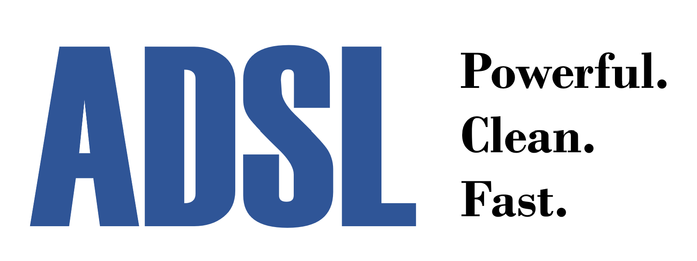

# adsl-cpp: A Data Science Library for C++

## Description
The ADSL C++17 project is a library intended for fast, accurate, idiomatic data processing. Integration with well-established visualization, numerical, and ML libraries is being implemented.

At ADSL's core is the `DataFrame` class to work with data sets. `DataFrame` is inspired by R's & Pandas' dataframes and can import data from a CSV file.

A cornerstone of the project is the ability to "chain together" operations on `DataFrame`s (and the `DataList`s within them) with the `+` operator. This is similar to R's pipe operator `%>%` or the UNIX-style pipe `|`.

**Note:** ADSL is for datasets of floating-point values. When ML is added, appropriate conversion functions for other 'discrete' types will be supplied.

## Examples

Gather and print all values in a `DataList` greater than 2 using a custom filter and print it:
```c
// assume 'dL' is a DataList defined previously...
auto cond = [](double x) {
  return x > 2;
};
DataList filtered = dL + adsl::filter(cond);
cout << filtered.str();
```
Perform a map-reduce to display the sum of squares of a `DataList`:
```c
// assume 'dL' is a DataList defined previously...
auto squareX = [](double x) {
        return x * x;
};
cout << dL + adsl::transform(squareX) + adsl::sum;
```
Increment the first column of a `DataFrame` twice:
```c
// assume 'df' is a DataFrame defined previously...
df = df + adsl::getFirst + adsl::inc + adsl::inc
```
Display a scatterplot using Gnuplot behind the scenes:
```c
adsl::vd tmp0 = { 1, 2, 3, 4 };
adsl::vd tmp1 = { 1, 2, 3, 4 };
DataList lst0 (tmp0, "DL 0"); // (data, name)
DataList lst1 (tmp1, "DL 1");
DataFrame df2;
df2.addCol(lst0);
df2.addCol(lst1);
df2.setDesc("Testing plotting 2D"); // DataFrame description
df2 + adsl::scatter2D; // Plot
```

## Installation

Right now development is happening in Visual Studio. The library _is_ header-only, so it should compile with any modern C++ compiler on Windows, MacOS, Linux, or UNIX. 

All you need to do to get started with ADSL is `#include "ADSL.h"` and install the dependencies below:

The following dependencies are required to be installed with the free [vcpkg](https://vcpkg.io/en/getting-started.html) package manager:
* The GNU Scientific Library (GSL): `.\vcpkg install gsl gsl:x64-windows`. [GSL](https://www.gnu.org/software/gsl/#subjects) is a C library with a large collection of numerical routines for everything from least-squares to simulated annealing.
* [NOT YET] Dlib: `.\vcpkg install dlib dlib:x64-windows`. [Dlib](http://dlib.net/ml.html) is a C++ library containing various numerical routines including many for ML.
* [NOT YET] TensorFlow: `.\vcpkg install tensorflow-cc tensorflow-cc:x64-windows`. TensorFlow is the famous ML library from Google.

The following dependencies are required to be installed manually:
* [Gnuplot (mingw version)](https://sourceforge.net/projects/gnuplot/files/gnuplot/5.4.2/). NOTE: make sure to check the box to add gnuplot to the PATH during installation.

## Planned Work:
* [STARTED] Add basic plotting capability built around Gnuplot
* [DONE] Create a function for loading in data from a CSV file
* Create a class DataFrameList for working with a vector of DataFrames
* [STARTED] Include a library of functions which are wrappers around STL functions like accumulate, sort, etc
* Include a library of basic statistical functions
* Include a library for working with financial data
