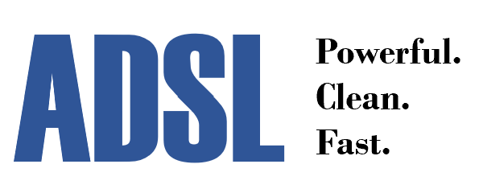

# adsl-cpp: A Data Science Library for C++

## Description
The ADSL C++ project is a library for performant and straightforward data science. ADSL includes:

* A library for manipulating data
* Scatterplots and other data visualizations _(via Gnuplot)_
* Statistical routines _(via GSL)_
* Machine learning routines _(via Dlib)_

At ADSL's core is the `DataFrame` class to work with data sets. `DataFrame` is inspired by R's & Pandas' dataframes and can import data from a CSV file.

A cornerstone of the project is the ability to "chain together" operations on `DataFrame`s (and the `DataList`s within them) with the `+` pipe operator. Data is passed along the chain of commands from left to right, enabling incredibly expressive software development. This is similar to R's pipe operator `%>%` or the UNIX-style pipe `|`.

Please note that ADSL is for datasets of floating-point values. When ML is added, appropriate conversion functions for other 'discrete' types like categorical labels will be supplied as necessary.

## Files
* ADSL.h - includes everything else
* DataFrame.h - class definitions for `DataFrame` and `DataList`
* Ops.h - basic operations on `DataLists` and `DataFrames`
* STL.h - wrappers around STL functions like `accumulate` and `transform`
* GSL.h - wrappers around GSL functions like `gsl_fit_linear`
* Plot.h - functions for plotting with Gnuplot
* Util.h - utility functions like those for reading in data from a file

## Examples

Gather and print all values in a `DataList` greater than 2 using a custom filter and print it:
```c
// assume 'dL' is a DataList defined previously...
auto cond = [](double x) {
  return x > 2;
};
DataList filtered = dL + adsl::filter(cond);
cout << filtered.str();
```
Perform a map-reduce to display the sum of squares of a `DataList`:
```c
// assume 'dL' is a DataList defined previously...
auto squareX = [](double x) {
        return x * x;
};
cout << dL + adsl::transform(squareX) + adsl::sum;
```
Increment the first column of a `DataFrame` twice:
```c
// assume 'df' is a DataFrame defined previously...
df = df + adsl::getFirst + adsl::inc + adsl::inc
```
Display a scatterplot using Gnuplot behind the scenes:
```c
adsl::vd tmp0 = { 1, 2, 3, 4 };
adsl::vd tmp1 = { 1, 2, 3, 4 };
DataList lst0 (tmp0, "DL 0"); // (data, name)
DataList lst1 (tmp1, "DL 1");
DataFrame df2;
df2.addCol(lst0);
df2.addCol(lst1);
df2.setDesc("Testing plotting 2D"); // DataFrame description
df2 + adsl::scatter2D; // Plot
```
Perform linear regression and print the value of the fitted function at an arbitrary point:
```cpp
// Assume 'df' is a 2-column DataFrame defined previously...
DataFrame linFit = df + adsl::fitLinear;
// linFit contains coeffs & r-squared
cout << "Prediction at x=5: " << linFit + adsl::evalFit(5);
```

## Writing your own ADSL chainable functions

Writing a chainable function is incredibly simple: any function returning a `DataList` or `DataFrame` and taking as input a `DataList` or `DataFrame` is chainable. (It's also possible to return `double` or `std::string`, but these kinds of functions can only be used at the end of a chain). 

This might seem limited, but with the power of C++ lambdas you can actually _pass in any kind of input of any type_ you want using a trick called **currying**.

To see an example of currying, take a look at the source for the function `adsl::filterLess(d)` (a function that filters out any values in a `DataList` not less than the input `d`):
```cpp
// Less than filter
// DataList <- DataList <- double
auto filterLess = [](double d) {
  auto retFunc = [d](DataList& dl) {
    DataList ret;
    ret.name = dl.name;
    for (double val : dl.vals) {
      if (val < d)
        ret.vals.emplace_back(val);
    }
    return ret;
  };
  return retFunc;
};
```

In the example above, we "wrap" a chainable lambda function operating on a `DataList` and returning a `DataList` with another lambda function that takes in a double. The variable `d` is _captured_ by the inner lambda inside of the brackets `[ ]`.

The trick here is that the outer function `filterLess` actually creates and returns the inner function `retFunc` on the spot when called. That's right, a function returning another function!

Thus, the user can supply a custom input `d` and the `+` pipe operator will only be exposed to a valid chainable function. 

In your extensions, the outer lambda can take in any number of arguments - just make sure to capture them inside the inner lambda's brackets `[ ]`. Outer arguments that are `DataFrame`s should be captured by reference in the inner lambda with a `&` like `[&df]`.

## Installation

Right now development is happening in Visual Studio 16 2019. The library _is_ header-only, so it should compile with any modern C++ compiler on Windows, MacOS, Linux, or UNIX. 

To get started with ADSL, download the repo and stick it inside of your project. Then add `#include "adsl-cpp/ADSL-CPP/ADSL-CPP/ADSL.h"`to your code and install the dependencies below:

The following dependencies are required to be installed (I used the awesome [vcpkg](https://vcpkg.io/en/getting-started.html) package manager):
* The GNU Scientific Library (GSL): `.\vcpkg install gsl gsl:x64-windows`. [GSL](https://www.gnu.org/software/gsl/#subjects) is a C library with a large collection of numerical routines for everything from least-squares to simulated annealing.
* Dlib: `.\vcpkg install dlib dlib:x64-windows`. [Dlib](http://dlib.net/ml.html) is a C++ library containing various numerical routines including many for ML.

The following dependencies are required to be installed manually:
* [Gnuplot (mingw version)](https://sourceforge.net/projects/gnuplot/files/gnuplot/5.4.2/). NOTE: make sure to check the box to add gnuplot to the PATH during installation.

## Work in Progress:
* Adding basic plotting capability built around Gnuplot
* Provide chainable wrappers around STL functions like accumulate, sort, etc
* Porting statistical functions from GSL

## Future Work:
* Incorporate Machine Learning with Dlib
* `DataFrameList` class for working with lists of DataFrames?
